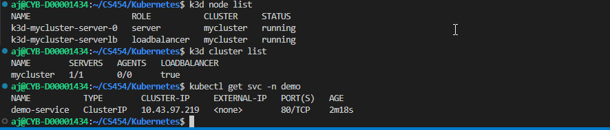
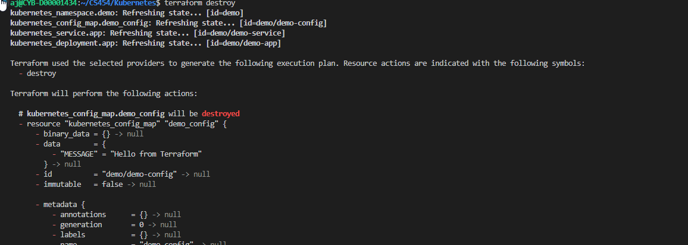
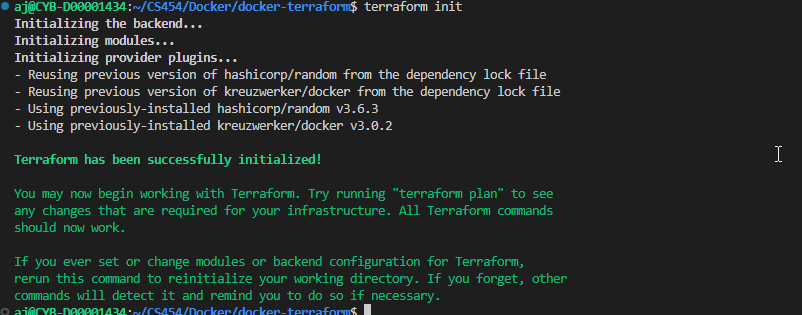
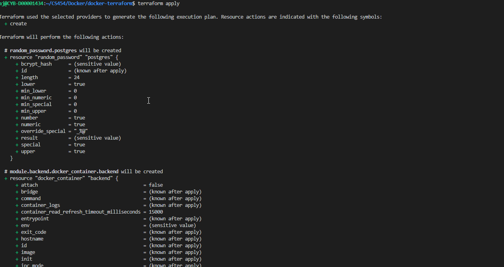
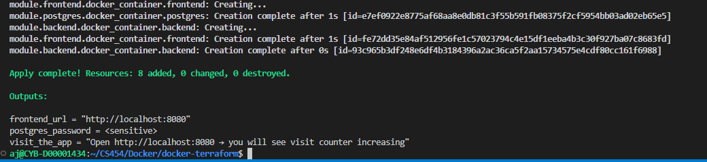
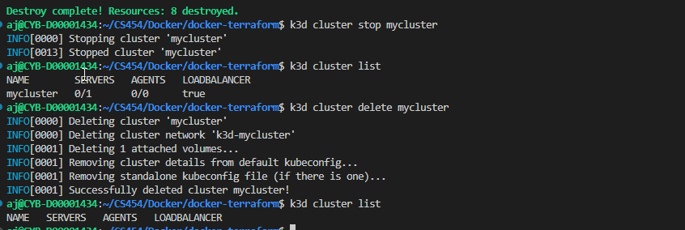

# Project2-CS454: Docker & Kubernetes Infrastructure

## Overview
This repository demonstrates containerization and orchestration using Docker and Kubernetes. It includes a backend application, infrastructure-as-code for Docker resources (via Terraform), and Kubernetes manifests for deploying services using k3d.

---

## Structure
- `Docker/`
  - `backend-app/`: Python backend app with Dockerfile and requirements.
  - `configs/`: Nginx Dockerfile and config.
  - `docker-terraform/`: Terraform scripts for Docker resources (backend, frontend, network, postgres).
- `Kubernetes/`
  - Terraform manifests for Kubernetes resources (namespace, deployment, service, configmap).

---

## Running the Docker Project

### 3. Terraform Docker Infrastructure
```bash
cd Docker/docker-terraform
terraform init
terraform apply

When done run:
terraform destroy
```

## Running the Kubernetes Project (with k3d)

### 1. Create k3d Cluster
```bash
k3d cluster create mycluster
```

### 2. Apply Terraform Manifests
```bash
cd Kubernetes
terraform init
terraform apply
```

### 3. Access Services
- Use `kubectl get svc -n <namespace>` to find service endpoints.
- Port-forward or expose as needed.

---

## Enhancements
### Docker Enhancement
- **Implemented:** Added Nginx reverse proxy for backend app to improve scalability and security.

### Kubernetes Enhancement
- **Implemented:** Added a ConfigMap to inject environment variables into the backend Deployment, improving configuration management and flexibility.

---

## Reflection
See `Reflection.md` for a summary of lessons learned and future directions.


## Screenshots






